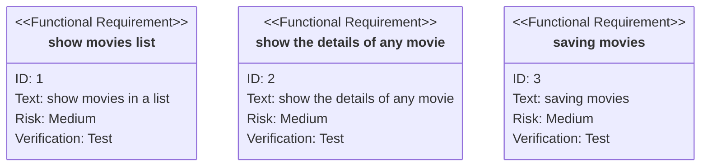
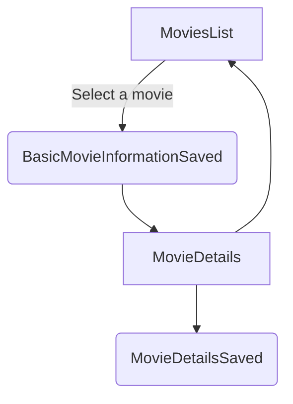
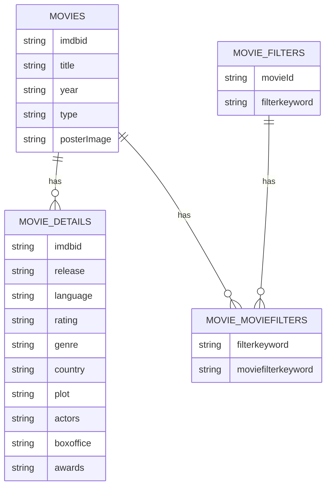
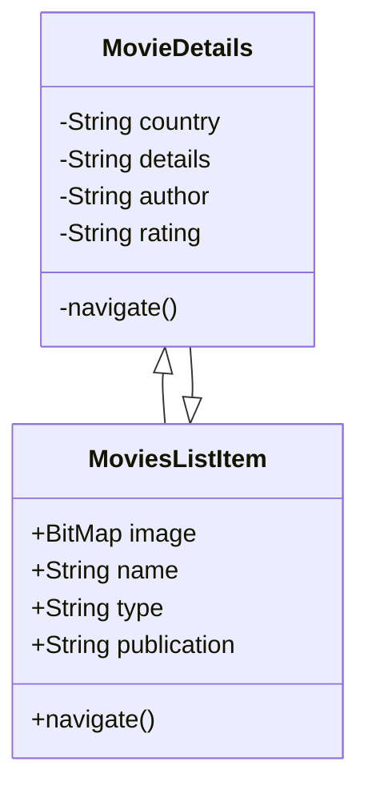

## [Requirement Diagram](http://mermaid-js.github.io/mermaid/#/requirementDiagram?id=requirement-diagram)

## Functional requirments

1. Show movies list
2. Show the details of any movie
3. Saving movies

### Improvments

- reorderby for sorting movies

## Design constraints

- Has to have a professional look

## Operational requirments

- Should be uploaded on multiple platforms
- Should have the capacity to incorporate multiple API's
- Should be kept updated on the expired API's

## Technical requirments

[//]: # (- Use MVVM pattern)
[//]: # (- Usage of lamda functions)
[//]: # (- Usage of dagger2)
[//]: # (- Usage of kotlin courotines)
[//]: # (- Usage of ROOM database framwork)
[//]: # (- Usage of view and databinding)
[//]: # (- Usage of extensions)
- Creating test cases

## Software requirments

- Starting from API 21

## Hardware requirments

- Aany android phone in the market

## Technical improvments

- Using mapper classes between domain and network models
- Using delegates
- make the view holder separate class
- data binding attributes
- Using kotlin flo with the view model
- Using Hilt
- Using kotlin compose
- Using kotlin compose multiplatform

## UI

<iframe style="border: 1px solid rgba(0, 0, 0, 0.1);" width="800" height="450" src="https://www.figma.com/embed?embed_host=share&url=https%3A%2F%2Fwww.figma.com%2Ffile%2Fp1tFHTs1EaIcEQc4T5zZsU%2FUntitled%3Ftype%3Ddesign%26node-id%3D0%253A1%26mode%3Ddesign%26t%3DMrtpB15w2oavFDeq-1" allowfullscreen></iframe>

## [Flowchart](http://mermaid-js.github.io/mermaid/#/./flowchart?id=flowcharts-basic-syntax)

[Entity Relationship Diagram](http://mermaid-js.github.io/mermaid/#/entityRelationshipDiagram?id=entity-relationship-diagrams)
------------------------------------------------------------------------------------------------------------------------------

## [Class Diagram](http://mermaid-js.github.io/mermaid/#/./classDiagram)

